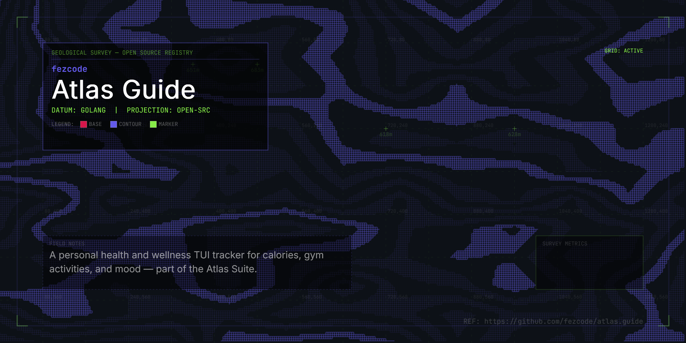

# atlas.guide



`atlas.guide` is a personal health and wellness TUI tracker for the Atlas Suite. Track your calories, gym activities, and daily mood — all from the terminal.

## Features

- **Day Overview**: See all your trackers at a glance with a completion score.
- **Calorie Tracking**: Log food with calories and protein. Built with a calorie deficit mentality — progress bar shows budget usage with color-coded thresholds.
- **Intermittent Fasting**: Set your fasting window and track adherence.
- **Gym Activities**: Log workouts with duration and calories burnt. Gym calories offset your food intake in the net calculation.
- **Mood Tracking**: Rate your day (1-5) with optional notes.
- **Monthly Overview**: Aggregated stats across the month — averages, totals, mood distribution, and a day-by-day heatmap.
- **Calendar Picker**: Visual month calendar to jump to any date. Days with data are highlighted.
- **Date Navigation**: Browse past days with arrow keys or jump to today instantly.
- **Persistent Storage**: All data saved to `~/.atlas/atlas.guide.data/` organized by date as JSON.

## Installation

```bash
gobake build
./build/atlas.guide
```

## Usage

### Tabs

| Key | Tab |
|-----|-----|
| `1` | Overview — day summary with all trackers |
| `2` | Calories — food log, budget, fasting |
| `3` | Gym — activities, duration, calories burnt |
| `4` | Mood — rating and notes |
| `5` | Monthly — month aggregates and heatmap |
| `Tab` | Cycle through tabs |

### Navigation

| Key | Action |
|-----|--------|
| `h` / `l`, `←` / `→` | Previous / Next day |
| `j` / `k`, `↑` / `↓` | Move cursor in lists |
| `t` | Jump to today |
| `c` | Open calendar picker |
| `H` / `L` | Previous / Next month (Monthly & Calendar) |

### Actions

| Key | Action |
|-----|--------|
| `a` | Add new entry |
| `d` | Delete selected entry / clear mood |
| `g` | Set daily calorie goal (Calories tab) |
| `f` | Toggle fasting window (Calories tab) |
| `?` | Show help |
| `q`, `Ctrl+C` | Quit |

## Data Storage

Data is stored in `~/.atlas/atlas.guide.data/` with the following structure:

```
~/.atlas/atlas.guide.data/
└── 2026-03-16/
    ├── calories.json
    ├── gym.json
    └── mood.json
```

## License

MIT
